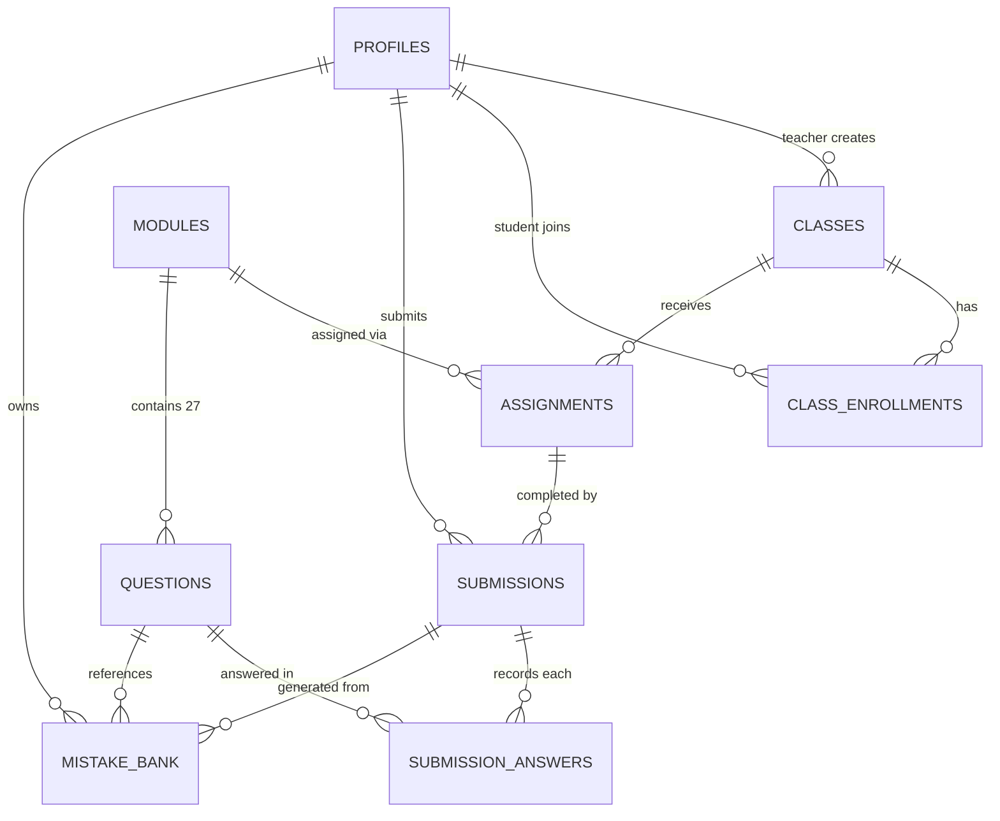

# SAT Math Platform — Implementation Plan

## 1. Technology Stack

| Layer | Technology | Justification |
|---|---|---|
| **Framework** | **Next.js 15 (App Router)** | Full-stack React framework with server components, API routes, and middleware — ideal for role-based routing and SSR dashboards. |
| **Styling** | **Tailwind CSS v4** | Utility-first CSS that enables rapid, consistent UI development and pixel-perfect reproduction of the Bluebook testing interface. |
| **Database & Auth** | **Supabase** (PostgreSQL + Auth + Storage) | Managed Postgres with built-in JWT auth, Row Level Security, role management, and S3-compatible storage for question images — all in one service. |
| **ORM** | **Drizzle ORM** | Type-safe, SQL-like ORM with excellent Supabase/Postgres support and zero runtime overhead — keeps queries predictable. |
| **Form Handling** | **React Hook Form + Zod** | Performant, uncontrolled form library paired with Zod for schema validation on both client and server. |
| **Data Visualization** | **Recharts** | Lightweight, composable React charting library — perfect for teacher dashboards showing score distributions and domain breakdowns. |
| **Deployment** | **Vercel** | Zero-config deployment for Next.js with edge functions, preview deployments, and automatic CI/CD. |

---

## 2. Database Schema

All tables live in the Supabase-managed PostgreSQL database. The schema below is written as raw SQL DDL. Drizzle ORM schema files will mirror this exactly during implementation.

### 2.1 Entity-Relationship Overview



### 2.2 Enum Types

```sql
-- Custom enum types
CREATE TYPE user_role       AS ENUM ('teacher', 'student');
CREATE TYPE question_type   AS ENUM ('MCQ', 'SPR');
CREATE TYPE domain_tag      AS ENUM ('Algebra', 'Advanced Math', 'Problem-Solving', 'Geometry/Trig');
```

### 2.3 Tables

#### `profiles`
Extends the Supabase `auth.users` table with application-specific data. Created automatically via a database trigger on user signup.

```sql
CREATE TABLE profiles (
    id          UUID PRIMARY KEY REFERENCES auth.users(id) ON DELETE CASCADE,
    email       TEXT NOT NULL UNIQUE,
    full_name   TEXT NOT NULL,
    role        user_role NOT NULL DEFAULT 'student',
    created_at  TIMESTAMPTZ NOT NULL DEFAULT now()
);
```

---

#### `classes`
A teacher-owned grouping that students are enrolled into.

```sql
CREATE TABLE classes (
    id          UUID PRIMARY KEY DEFAULT gen_random_uuid(),
    teacher_id  UUID NOT NULL REFERENCES profiles(id) ON DELETE CASCADE,
    name        TEXT NOT NULL,
    created_at  TIMESTAMPTZ NOT NULL DEFAULT now()
);
```

---

#### `class_enrollments`
Join table linking students to classes. A student is added by their registration email.

```sql
CREATE TABLE class_enrollments (
    id          UUID PRIMARY KEY DEFAULT gen_random_uuid(),
    class_id    UUID NOT NULL REFERENCES classes(id) ON DELETE CASCADE,
    student_id  UUID NOT NULL REFERENCES profiles(id) ON DELETE CASCADE,
    enrolled_at TIMESTAMPTZ NOT NULL DEFAULT now(),

    UNIQUE (class_id, student_id)
);
```

---

#### `modules`
A fixed set of 27 questions. Created by the teacher.

```sql
CREATE TABLE modules (
    id          UUID PRIMARY KEY DEFAULT gen_random_uuid(),
    title       TEXT NOT NULL,
    created_by  UUID NOT NULL REFERENCES profiles(id) ON DELETE CASCADE,
    created_at  TIMESTAMPTZ NOT NULL DEFAULT now()
);
```

---

#### `questions`
Individual questions belonging to a module. Each module has exactly 27 rows.

```sql
CREATE TABLE questions (
    id              UUID PRIMARY KEY DEFAULT gen_random_uuid(),
    module_id       UUID NOT NULL REFERENCES modules(id) ON DELETE CASCADE,
    question_number INTEGER NOT NULL CHECK (question_number BETWEEN 1 AND 27),
    question_text   TEXT NOT NULL,
    image_url       TEXT,                          -- optional, points to Supabase Storage
    question_type   question_type NOT NULL,
    domain_tag      domain_tag NOT NULL,
    choices         JSONB,                         -- {"A": "...", "B": "...", "C": "...", "D": "..."} for MCQ; NULL for SPR
    correct_answer  TEXT NOT NULL,                  -- 'A','B','C','D' for MCQ; exact numeric string for SPR

    UNIQUE (module_id, question_number)
);
```

> **Note:** For MCQ questions, `correct_answer` stores a single letter (A–D) and `choices` stores a JSON object with the four labeled options. For SPR (Student-Produced Response) questions, `correct_answer` stores the exact numeric value as a string and `choices` is NULL.

---

#### `assignments`
Links a module to a class, making it available for students to complete.

```sql
CREATE TABLE assignments (
    id          UUID PRIMARY KEY DEFAULT gen_random_uuid(),
    class_id    UUID NOT NULL REFERENCES classes(id) ON DELETE CASCADE,
    module_id   UUID NOT NULL REFERENCES modules(id) ON DELETE CASCADE,
    assigned_at TIMESTAMPTZ NOT NULL DEFAULT now(),
    due_date    TIMESTAMPTZ,

    UNIQUE (class_id, module_id)
);
```

---

#### `submissions`
One row per student per assignment attempt. Records the aggregate result.

```sql
CREATE TABLE submissions (
    id              UUID PRIMARY KEY DEFAULT gen_random_uuid(),
    assignment_id   UUID NOT NULL REFERENCES assignments(id) ON DELETE CASCADE,
    student_id      UUID NOT NULL REFERENCES profiles(id) ON DELETE CASCADE,
    raw_score       INTEGER NOT NULL CHECK (raw_score BETWEEN 0 AND 27),
    time_elapsed    INTEGER NOT NULL,              -- total seconds spent
    submitted_at    TIMESTAMPTZ NOT NULL DEFAULT now(),

    UNIQUE (assignment_id, student_id)
);
```

> **Important:** The `UNIQUE (assignment_id, student_id)` constraint means each student can submit a given assignment **exactly once**. If re-takes are needed in the future, this constraint can be relaxed.

---

#### `submission_answers`
Stores the exact value the student submitted for **every** question in the assignment — enabling full teacher review.

```sql
CREATE TABLE submission_answers (
    id              UUID PRIMARY KEY DEFAULT gen_random_uuid(),
    submission_id   UUID NOT NULL REFERENCES submissions(id) ON DELETE CASCADE,
    question_id     UUID NOT NULL REFERENCES questions(id) ON DELETE CASCADE,
    student_answer  TEXT,                          -- NULL if the student skipped the question
    is_correct      BOOLEAN NOT NULL,

    UNIQUE (submission_id, question_id)
);
```

---

#### `mistake_bank`
Automatically populated when a student answers a question incorrectly. Serves as a personalized review list.

```sql
CREATE TABLE mistake_bank (
    id              UUID PRIMARY KEY DEFAULT gen_random_uuid(),
    student_id      UUID NOT NULL REFERENCES profiles(id) ON DELETE CASCADE,
    question_id     UUID NOT NULL REFERENCES questions(id) ON DELETE CASCADE,
    submission_id   UUID NOT NULL REFERENCES submissions(id) ON DELETE CASCADE,
    student_answer  TEXT NOT NULL,                  -- the incorrect value they submitted
    correct_answer  TEXT NOT NULL,                  -- copied from questions.correct_answer for quick access
    is_remembered   BOOLEAN NOT NULL DEFAULT false, -- student toggles when they've reviewed/mastered it
    created_at      TIMESTAMPTZ NOT NULL DEFAULT now(),

    UNIQUE (student_id, question_id, submission_id)
);
```

---

### 2.4 Auto-Population Trigger (Mistake Bank)

```sql
CREATE OR REPLACE FUNCTION populate_mistake_bank()
RETURNS TRIGGER AS $$
BEGIN
    IF NEW.is_correct = false AND NEW.student_answer IS NOT NULL THEN
        INSERT INTO mistake_bank (student_id, question_id, submission_id, student_answer, correct_answer)
        SELECT
            s.student_id,
            NEW.question_id,
            NEW.submission_id,
            NEW.student_answer,
            q.correct_answer
        FROM submissions s
        JOIN questions q ON q.id = NEW.question_id
        WHERE s.id = NEW.submission_id
        ON CONFLICT (student_id, question_id, submission_id) DO NOTHING;
    END IF;
    RETURN NEW;
END;
$$ LANGUAGE plpgsql;

CREATE TRIGGER trg_populate_mistake_bank
AFTER INSERT ON submission_answers
FOR EACH ROW
EXECUTE FUNCTION populate_mistake_bank();
```

---

### 2.5 Profile Auto-Creation Trigger

Automatically creates a `profiles` row when a new user signs up via Supabase Auth:

```sql
CREATE OR REPLACE FUNCTION handle_new_user()
RETURNS TRIGGER AS $$
BEGIN
    INSERT INTO profiles (id, email, full_name, role)
    VALUES (
        NEW.id,
        NEW.email,
        COALESCE(NEW.raw_user_meta_data ->> 'full_name', ''),
        COALESCE(NEW.raw_user_meta_data ->> 'role', 'student')::user_role
    );
    RETURN NEW;
END;
$$ LANGUAGE plpgsql SECURITY DEFINER;

CREATE TRIGGER on_auth_user_created
AFTER INSERT ON auth.users
FOR EACH ROW
EXECUTE FUNCTION handle_new_user();
```

---

### 2.6 Indexes

```sql
-- Frequently queried lookups
CREATE INDEX idx_class_enrollments_student  ON class_enrollments(student_id);
CREATE INDEX idx_class_enrollments_class    ON class_enrollments(class_id);
CREATE INDEX idx_questions_module           ON questions(module_id);
CREATE INDEX idx_assignments_class          ON assignments(class_id);
CREATE INDEX idx_submissions_assignment     ON submissions(assignment_id);
CREATE INDEX idx_submissions_student        ON submissions(student_id);
CREATE INDEX idx_submission_answers_sub     ON submission_answers(submission_id);
CREATE INDEX idx_mistake_bank_student       ON mistake_bank(student_id);
CREATE INDEX idx_mistake_bank_question      ON mistake_bank(question_id);
```

---

## 3. Summary of Tables

| # | Table | Purpose | Key Relationships |
|---|---|---|---|
| 1 | `profiles` | User identity & role | Extends `auth.users` |
| 2 | `classes` | Teacher-owned student grouping | → `profiles` (teacher) |
| 3 | `class_enrollments` | Student ↔ Class membership | → `profiles`, → `classes` |
| 4 | `modules` | Container for 27 questions | → `profiles` (creator) |
| 5 | `questions` | Individual question content | → `modules` |
| 6 | `assignments` | Module assigned to a class | → `classes`, → `modules` |
| 7 | `submissions` | Student's completed attempt | → `assignments`, → `profiles` |
| 8 | `submission_answers` | Per-question student response | → `submissions`, → `questions` |
| 9 | `mistake_bank` | Incorrect answers for review | → `profiles`, → `questions`, → `submissions` |

---

## Open Questions

> **1. Supabase project:** Do you already have a Supabase project set up, or should I include full project initialization instructions?

> **2. MCQ answer choices:** I added a `choices JSONB` column to the `questions` table to store the four labeled options (A–D) for MCQ rendering. The Bluebook interface needs this to display answers. Please confirm this addition is acceptable.

> **3. Authentication flow:** Should students self-register (email/password) and then the teacher enrolls them by email? Or should the teacher send invite links that auto-enroll on signup?

> **4. Tailwind CSS version:** I propose **Tailwind CSS v4** for its latest features. Please confirm, or specify v3 if you prefer the more established version.

---

## Verification Plan

### Before Moving to Code
- [ ] User approves the technology stack
- [ ] User approves all 9 tables and their columns
- [ ] Open questions above are resolved

### After Schema Implementation
- Run the full SQL DDL against a Supabase project and verify all tables, enums, triggers, and indexes are created without errors.
- Insert sample data covering: 1 teacher, 1 class, 2 students, 1 module with 27 questions, 1 assignment, 2 submissions with full answer sets, and verify mistake_bank auto-population.
